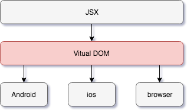

# Chap 01. React Native 入門

## React Native 簡介

- Facebook 2015 年 4 月開源的跨平台移動應用開發框架
- UI 框架 React 在原生移動應用平台的衍生產物
- 支持 iOS 和 Android 兩大平台
- Learn once, write anywhere
- 原理是在 JavaScript 中使用 React 抽象操作系統的原生 UI 組件，代替 DOM 元素來渲染介面 (`<View>` 取代 `
`、`<Image>` 取代 `` 等)
- 主要運行兩個線程：主線程和 JavaScript 引擎線程，兩個線程之間透過批量化的 async 消息協議來通信
- UI：Flexbox 佈局，支持 CSS 子集
- 可用 JSX or JavaScript，以及 CoffeeScript 和 TypeScript 來開發
- 使用同一份業務邏輯核心代碼創建原生應用運行在 Web 端、Android 端和 iOS 端

React Native 相比 Web 開發或原生開發主要有以下特點：

- APP 占用體積小
- 實現跨平台開發

  - 基於 Web 移動應用速度快，開發週期短，但是體驗較差
  - 原生開發週期長，項目風險不可控

  提高開發效率，節約人力成本。React Native 出現解決上述這些問題

- 相對成熟的技術
- 支持動態更新 (iOS 也可以且不碰觸蘋果底線)

## React Native 工作原理

Virtual DOM 就像一個中間虛擬層，位於 JavaScript 和實際渲染頁面之間。透過 batching 和高效 Diff 算法在虛擬層，再將差異更新真實 DOM，提高介面構建性能。

在界面渲染過程中，React Native 針對不同平台調用原生 API 去渲染介面。體驗更加接近原生 APP。

### 虛擬 DOM 和 MVVM 的對比

虛擬 DOM 只是 MVVM 框架的一種實現方案，兩者沒有好壞之分。在流行的前端框架中，除了 React 採用虛擬 DOM 之外，其他 MVVM 系列框架，如 Angular、Vue、Avalon，採用的都是數據綁定。

何謂數據綁定？簡單來說，就是透過觀察 Directive/Binding 對象數據變化，並保留對實際 DOM 元素的引用，當有數據變化時進行對應的操作。React 檢查是 DOM 結構層面的，而 MVVM 的檢查則是數據層面的。MVVM 的性能檢測也根據檢測層面的不同而有所不同：Angular 的髒檢查使得任何變動都會產生固定的更新的代價；而 Vue/Avalon 採用的依賴收集，使得在 JS 和 DOM 層面都會產生更新。

上面提到的兩個概念 —— 髒檢查和依賴收集

- 髒檢查：scope digest + 必要 DOM 更新
- 依賴收集：重新收集依賴 + 必要 DOM 更新

可以看出，Angular 效率低的時候在於任何小變動都會引起介面的重繪，但是，當所有數據都變化的時候，Angular 並不吃虧。依賴收集在初始化和數據變化的時候都需要重新收集依賴，在數據流比較小的時候幾乎可以忽略，但在數據量比較大的時候就會產生一定的消耗。相比之下，React 的變動檢查則是 DOM 結構層面的，即使是全新的數據，只要渲染結果沒有變化，也不需要重新繪製。

Angular 和 Vue 都提供了重繪的優化機制，及有效地復用實例和 DOM 元素。在優化的版本中，Angular 和 Vue 都採用了 track by $index 技術後比 React 的效率更高。

所以在框架選擇和技術性能分析的時候，要分清楚初始渲染、小量數據更新、大量數據更新這些不同的場合，以及 DOM、髒檢查 MVVM、數據收集 MVVM 在不同場合各自的表現和優缺點，具體表現和區塊如下：

- 初始渲染階段：Virtual DOM > 髒檢查 >= 依賴收集
- 小量數據更新時：依賴收集 > Virtual DOM + 優化 > 髒檢查 (無法優化) > Virtual DOM 無優化
- 大量數據更新時：髒檢查 + 優化 >= 依賴收集 + 優化 > Virtual DOM (無優化) > MVVM 無優化

## React Native 與其他跨平台技術的對比優勢

跨平台技術分四大流派：

- Web 流：也被稱為 Hybrid 技術，它基於 Web 相關技術來實現介面及功能
- 代碼轉換流：將某語言轉成 Objective-C、Java or C#，然後使用不同平台下的官方工具來開發
- 編譯流：將某個語言編譯為二進制文件，生成動態庫或打包成 apk/ipa/xap 文件
- 虛擬機流：透過將某個語言的虛擬機移植到不同的平台上來運行

### web 流

Web 流，PhoneGap/Cordova 等技術，它將原生的接口封裝後曝露給 JavaScript，然後透過系統自帶的 WebView 運行，也可以使自己內嵌